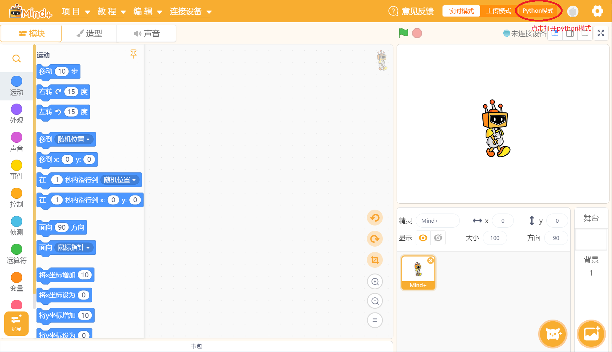
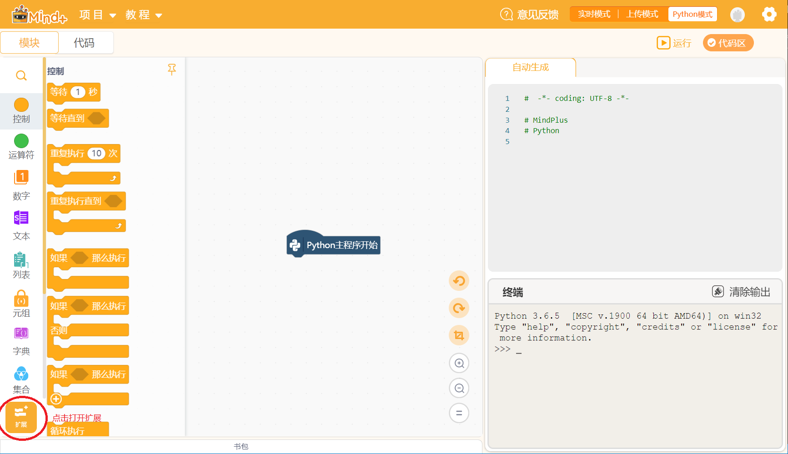
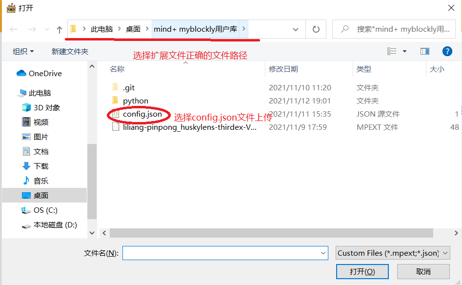
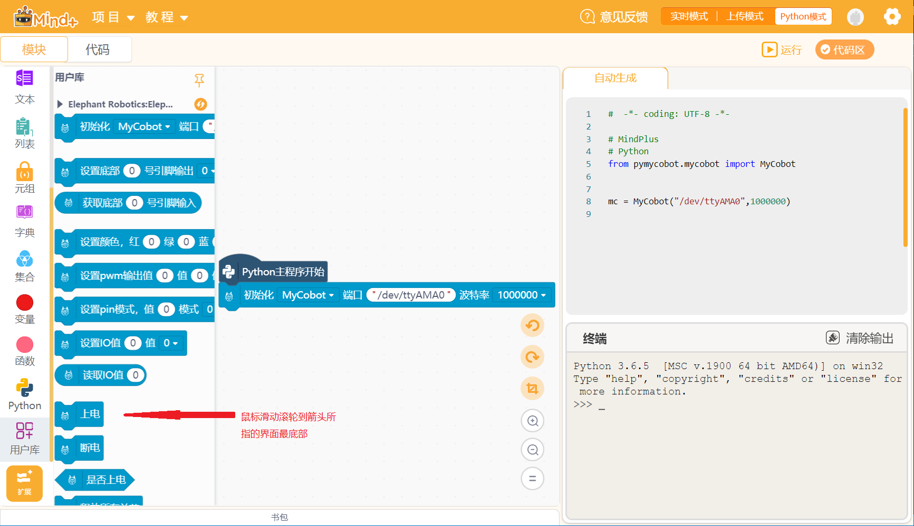

# ElephantMycobot机械臂Mind+用户库使用步骤

1. 进入mind+程序选择python模式，并点击模块

2. 点击扩展

3. 点击用户库

4. 选择config.json文件所在文件路径

5. 选择初始化模块初始引入相关接口以及初始化机器相关信息
 

* 备注:V0.0.1  基础功能完成
* 当进入用户库提示需要下载依赖文件时选择是进行下载，否则会出现调用函数失败的警告，如果不小心跳过的话，重新进入一次程序按照流程引入用户库，选择下载依赖即可

