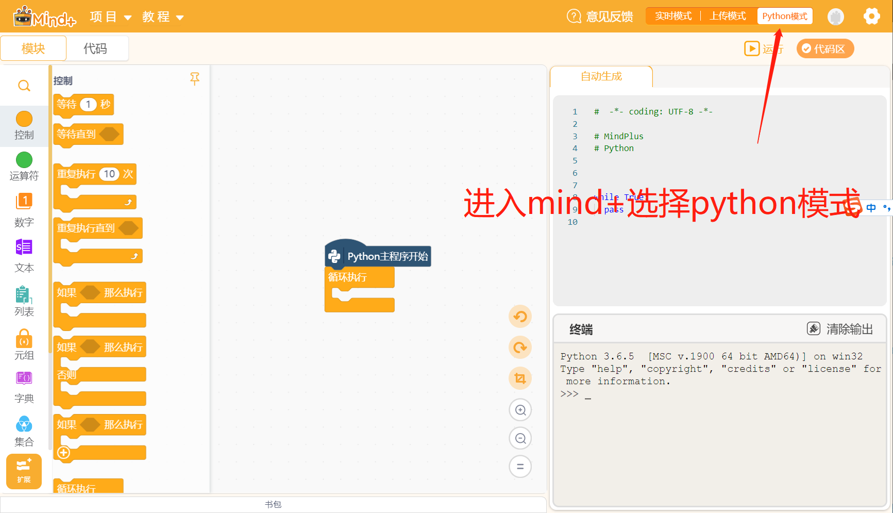
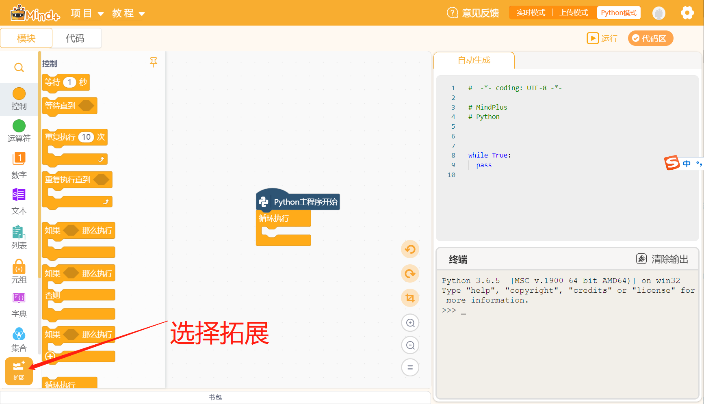

## ElephantMycobot机械臂Mind+用户库使用步骤

#### 大象机器人官网：<https://www.elephantrobotics.com/>
#### 大象机器人淘宝官网：<https://shop504055678.taobao.com/>
#### mind+ windows版本下载地址：<http://download3.dfrobot.com.cn/Mind+_Win_V1.6.2_RC2.0.exe>
#### mind+ macos版本下载地址：<http://download3.dfrobot.com.cn/Mind+_Mac_V1.7.1_RC1.0.dmg>
#### mind+ linux版本下载地址：<https://mindplus.dfrobot.com.cn/linux>
#### mind+使用教程地址：<https://mindplus.dfrobot.com.cn/ext-api>

### mind+软件使用图文步骤
1. 进入mind+选择python模式

2. 选择拓展

3. 选择用户库并在搜索框内输入关键字(ele,phant,mycobot,pi)获取大象机器人相关用户库,再点击返回回到操作界面

4. 在操作界面滑到最底部找到大象机器人用户库，并拖动积木块执行相关操作